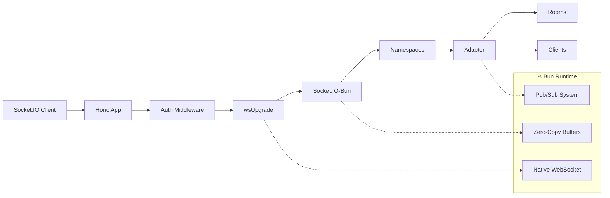

# ⚡ Socket.IO-Bun

A high-performance, fully-typed Socket.IO implementation for Bun runtime with Hono framework integration.

[](https://bun.sh)
[](https://www.typescriptlang.org/)
[](https://hono.dev)
[](https://socket.io/docs/v4/)

## ⚠️ Production Warning

> **Warning**: This library is out of active development. It can be used in a production environment, but in the future we will change the adapter architecture for direct integration with bun pub/sub. Therefore, the `except()` method will work differently.

## 🚀 Features

-   **🎯 Native Bun WebSocket**: Built exclusively for Bun's native WebSocket API - no HTTP queries (polling not supported)
-   **⚡ Zero-Copy Performance**: Optimized data flow with minimal buffer copying and SharedArrayBuffer support
-   **🔒 Full Type Safety**: Complete TypeScript support with strict event typing and compile-time validation
-   **🌐 Socket.IO Compatible**: Supports Socket.IO protocol v4+ and works with official Socket.IO clients
-   **📦 Lightweight**: Single transport architecture eliminates Engine.IO overhead
-   **🏗️ Hono Integration**: Seamless integration with Hono framework for modern web applications (simple)
-   **🏠 Namespace Support**: Full namespace isolation with dynamic namespace creation
-   **🎪 Middleware Support**: Powerful middleware system for authentication and validation
-   **🏢 Room Management**: Efficient room-based broadcasting with socket.io adapter

## ⌚ In Progress

-   **🏢 Room Management**: Efficient room-based broadcasting with Bun's native pub/sub only (in progress)
-   **♻️ Session Aware Adapter**: Restore persisted session when disconnecting (in progress)
-   **🔌 Adapter Pattern**: Extensible adapter for scaling across multiple servers (next major release)

## 📋 Requirements

-   **Bun**: 1.2 or higher
-   **TypeScript**: 5.0 or higher
-   **Hono**: 4.7 or higher

## 📦 Installation

```bash
# Using Bun (only)
bun add socket.io-bun hono
```

## 🚀 Quick Start

### Server Setup

```typescript
import { Hono } from 'hono';
import { createBunWebSocket } from 'hono/bun';
import { Server } from 'socket.io-bun';

// Define your event types
interface ClientToServerEvents {
	message: (content: string) => void;
	join_room: (room: string, callback: (success: boolean) => void) => void;
}

interface ServerToClientEvents {
	message: (data: { user: string; content: string; timestamp: string }) => void;
	user_joined: (user: string) => void;
}

interface SocketData {
	user: {
		id: string;
		name: string;
	};
}

// Create Socket.IO server
const io = new Server<ClientToServerEvents, ServerToClientEvents, any, SocketData>();

// Create WebSocket handler
const { upgradeWebSocket, websocket } = createBunWebSocket();

// WebSocket upgrade handler
const wsUpgrade = upgradeWebSocket((c) => {
	const user = c.get('user') || { id: 'anonymous', name: 'Anonymous' };

	return io.onconnection(c, { user });
});

// Hono app setup
const app = new Hono();

// Authentication middleware
app.use('/ws/*', async (c, next) => {
	// Your authentication logic here
	c.set('user', { id: 'user123', name: 'John Doe' });
	await next();
});

app.get('/ws', wsUpgrade);
app.get('/ws/*', wsUpgrade);

// Start server
const server = Bun.serve({
	hostname: 'localhost',
	port: 8443,
	fetch: app.fetch,
	websocket: {
		open: websocket.open,
		message: websocket.message,
		close: websocket.close,
		sendPings: false,
		idleTimeout: 0, // heartbeat by engine.io
		publishToSelf: false, // pub/sub default
		backpressureLimit: 16 * 1024 * 1024, // 16MB
		maxPayloadLength: 16 * 1024 * 1024, // 16MB
	},
});

// Attach Socket.IO to Bun server
io.attach(server);

// Socket.IO event handlers
io.on('connection', (socket) => {
	console.log('User connected:', socket.data.user.name);

	socket.on('message', (content) => {
		io.emit('message', {
			user: socket.data.user.name,
			content,
			timestamp: new Date().toISOString(),
		});
	});

	socket.on('join_room', (room, callback) => {
		socket.join(room);
		socket.to(room).emit('user_joined', socket.data.user.name);
		callback(true);
	});

	socket.on('disconnect', (reason) => {
		console.log('User disconnected:', socket.data.user.name, reason);
	});
});

console.log('🚀 Server running on http://localhost:3000');
```

### Client Usage

```typescript
import { io } from 'socket.io-client';

// Type-safe client connection
const socket = io('ws://localhost:3000', {
	path: '/ws',
	transports: ['websocket'],
});

socket.on('connect', () => {
	console.log('Connected to server');

	// Send a message
	socket.emit('message', 'Hello, world!');

	// Join a room with acknowledgment
	socket.emit('join_room', 'general', (success) => {
		if (success) {
			console.log('Joined room successfully');
		}
	});
});

socket.on('message', (data) => {
	console.log(`${data.user}: ${data.content}`);
});

socket.on('user_joined', (user) => {
	console.log(`${user} joined the room`);
});
```

## 🏗️ Architecture Overview

Socket.IO-Bun eliminates the complexity of multiple transports by focusing exclusively on Bun's native WebSocket implementation:



## 📚 Advanced Features

### Namespaces

```typescript
// Create namespaces
const chatNamespace = io.of('/chat');
const gameNamespace = io.of('/game');

chatNamespace.on('connection', (socket) => {
	console.log('Chat connection:', socket.id);
});

// Dynamic namespaces with regex
const dynamicNamespace = io.of(/^\/room-\d+$/);
dynamicNamespace.on('connection', (socket) => {
	console.log('Dynamic namespace:', socket.nsp.name);
});
```

### Room Broadcasting

```typescript
io.on('connection', (socket) => {
	// Join multiple rooms
	socket.join(['room1', 'room2', 'room3']);

	// Broadcast to specific room (self excluded)
	socket.to('room1').emit('message', 'Hello room1!');

	// Broadcast to multiple rooms (self excluded)
	socket.to(['room1', 'room2']).emit('message', 'Hello multiple rooms!');

	// Broadcast to all except specific rooms
	socket.except('room3').emit('message', 'Hello everyone except room3!');
});
```

### Middleware System

```typescript
// Global middleware
io.use((socket, next) => {
	const token = socket.handshake.auth.token;
	if (isValidToken(token)) {
		socket.data.user = getUserFromToken(token);
		next();
	} else {
		next(new Error('Authentication failed'));
	}
});

// Namespace-specific middleware
chatNamespace.use((socket, next) => {
	if (socket.data.user.role === 'banned') {
		next(new Error('User is banned from chat'));
	} else {
		next();
	}
});

// Socket-level middleware
io.on('connection', (socket) => {
	socket.use((event, next) => {
		if (isRateLimited(socket.data.user.id)) {
			next(new Error('Rate limit exceeded'));
		} else {
			next();
		}
	});
});
```

### Type-Safe Events

```typescript
interface GameEventsClientToServer {
	player_move: (data: { x: number; y: number }) => void;
	join_game: (gameId: string, callback: (success: boolean) => void) => void;
}

interface GameEventsServerToClient {
	game_update: (state: GameState) => void;
	player_joined: (player: Player) => void;
}

const gameServer = new Server<GameEventsClientToServer, GameEventsServerToClient>();

gameServer.on('connection', (socket) => {
	// Fully typed event handlers
	socket.on('player_move', (data) => {
		// data is automatically typed as { x: number; y: number }
		validateMove(data.x, data.y);
	});

	socket.on('join_game', (gameId, callback) => {
		// gameId is string, callback is (success: boolean) => void
		const success = addPlayerToGame(gameId, socket.id);
		callback(success);
	});
});
```

## 🔧 Configuration Options

```typescript
const io = new Server({
	// Connection timeout (default: 45000ms)
	connectTimeout: 30000,

	// Path for WebSocket endpoint (default: '/ws')
	path: '/ws',

	// Ping settings
	pingTimeout: 20000,
	pingInterval: 25000,

	// Custom adapter (for scaling)
	// adapter: CustomAdapter, (not supported yet)

	// Cleanup empty child namespaces (default: false)
	cleanupEmptyChildNamespaces: true,
});
```

## 🧪 Testing

The library includes comprehensive test coverage:

```bash
# Run all tests
bun test

# Run specific test suites
bun test:unit          # Unit tests
bun test:example       # Example integration tests
bun test:chat          # Chat system tests
```

## 🏎️ Performance

Socket.IO-Bun is optimized for Bun's strengths:

-   **Zero-copy message passing** with direct Uint8Array transfers
-   **Native pub/sub** using Bun's WebSocket topic subscription
-   **Efficient room broadcasting** with parallel client transmission
-   **Optimized packet encoding** with pre-compiled templates
-   **Memory-efficient connection pooling** with automatic cleanup

## 🔌 Socket.IO Client Compatibility

Works seamlessly with the official Socket.IO client:

```bash
# Install official client
npm install socket.io-client
```

```javascript
// Browser
import { io } from 'socket.io-client';
const socket = io('ws://localhost:3000', { path: '/ws' });

// Node.js
const { io } = require('socket.io-client');
const socket = io('ws://localhost:3000', { path: '/ws' });
```

## 🤝 Contributing

Contributions are welcome! Please check out our [contributing guidelines](CONTRIBUTING.md) and feel free to submit issues and pull requests.

## 📄 License

MIT License - see [LICENSE](LICENSE) file for details.

## 🙏 Acknowledgments

-   **Socket.IO Team** for the excellent protocol and client library
-   **Bun Team** for the incredible runtime and WebSocket implementation
-   **Hono Team** for the lightweight, fast web framework

---

**Built with ❤️ for the Bun ecosystem by [@phederal](https://github.com/phederal)**
